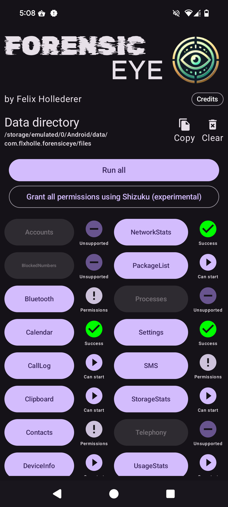

[#top]

<br />
<div align="center">
  <a href="https://github.com/flxholle/ForensicEye">
     </a>
  <h1 align="center">ForensicEye</h1>

  <p align="center">
    A Modular Android App for On-Device Forensic Data Collection
  </p>
</div>


<details>
  <summary>Table of Contents</summary>
  <ol>
    <li>
      <a href="#about-the-project">About The Project</a>
      <ul>
        <li><a href="#built-with">Built With</a></li>
        <li><a href="#features">Features</a></li>
        <li><a href="#limitations">Limitations</a></li>
      </ul>
    </li>
    <li>
      <a href="#getting-started">Getting Started</a>
      <ul>
        <li><a href="#prerequisites">Prerequisites</a></li>
        <li><a href="#installation">Installation</a></li>
      </ul>
    </li>
    <li><a href="#usage">Usage</a></li>
    <li><a href="#roadmap">Roadmap</a></li>
    <li><a href="#contact">Contact</a></li>
    <li><a href="#acknowledgments">Acknowledgments</a></li>
    <li><a href="#license">License</a></li>
  </ol>
</details>

## About The Project

<div align="center">

</div>


ForensicEye is a tool for non-root forensic data acquisition on Android devices. Unlike traditional
approaches that rely on ADB or root access, ForensicEye operates directly on the device, enabling
data extraction by non-expert users without the need for additional hardware.

### Features

- **Non-root Data Acquisition**: Retrieve data without the need for root access or ADB.
- **User-Friendly**: Designed for non-expert users to easily extract data.
- **Comprehensive Data Retrieval**: Access nearly all data available through system APIs, including:
    - Device information
    - Contacts
    - SMS
    - Calls
    - Calendars
    - Health data
    - Usage statistics
- **Modular Architecture**: Supports extensibility and maintainability.

### Limitations

- **Restricted Access**: Limited access to system-only APIs and third-party app data due to
  Android’s permission and sandboxing model.
- **Fragmented Environment**: Challenges posed by Android’s fragmented and evolving environment,
  including undocumented features and unstable APIs.
- **Manual Validation**: The need for manual validation due to the evolving nature of Android APIs.

### Built With

* [](https://kotlinlang.org/)
* [](https://developer.android.com/jetpack/compose)
* [](https://developer.android.com/studio)


<div align="right">(<a href="#top">back to top</a>)</div>

## Getting Started

To get a local copy up and running follow these simple steps.

### Prerequisites

* [Android Studio](https://developer.android.com/studio)
* Android device or emulator (integrated in Android Studio)

### Installation

1. Clone the repository:
   ```sh
   git clone https://github.com/flxholle/ForensicEye
   ```
2. Open the project in Android Studio.
3. Build and run the project on your Android device.

<div align="right">(<a href="#top">back to top</a>)</div>

## Usage

1. Launch the ForensicEye app on your Android device.
2. Follow the on-screen instructions to grant necessary permissions.
3. Use the provided buttons to extract and view data.

<div align="right">(<a href="#top">back to top</a>)</div>

## Roadmap

- [ ] Set as default SMS or phone app
- [ ] Shizuku integration
- [ ] Implement device owner

<div align="right">(<a href="#top">back to top</a>)</div>

## Contact

Felix Hollederer - [@flxholle](https://flxholle.gitlab.io/) - flxholle@posteo.com

Project
Link: https://github.com/flxholle/ForensicEye](https://github.com/flxholle/ForensicEye)

<div align="right">(<a href="#top">back to top</a>)</div>

## Acknowledgments

* [Rubik Glitch Font](https://fonts.google.com/specimen/Rubik+Glitch) under the [SIL Open Font License](https://openfontlicense.org/)
* [Aldrich Font](https://fonts.google.com/specimen/Aldrich) under the [SIL Open Font License](https://openfontlicense.org/)
* [Shizuku](https://github.com/RikkaApps/Shizuku) under the [Apache License 2.0](https://github.com/RikkaApps/Shizuku/blob/master/LICENSE)
* [ACRA](https://github.com/ACRA/acra) under the [Apache License 2.0](https://github.com/ACRA/acra/blob/master/LICENSE)
* [AndroidX](https://developer.android.com/jetpack/androidx)
* [Kotlin](https://kotlinlang.org/)
* [Gradle](https://gradle.org/)

<div align="right">(<a href="#top">back to top</a>)</div>

## License
Distributed under the Apache License 2.0. See `LICENSE.txt` for more information.

<div align="right">(<a href="#top">back to top</a>)</div>