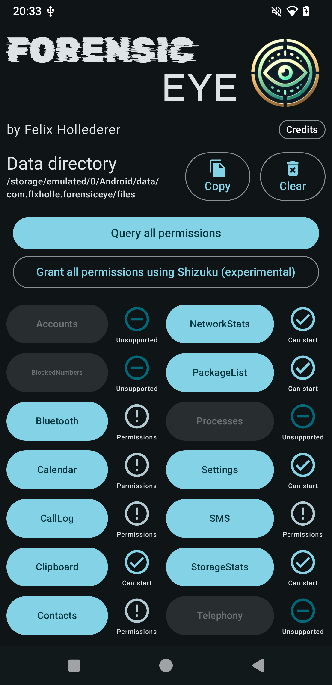
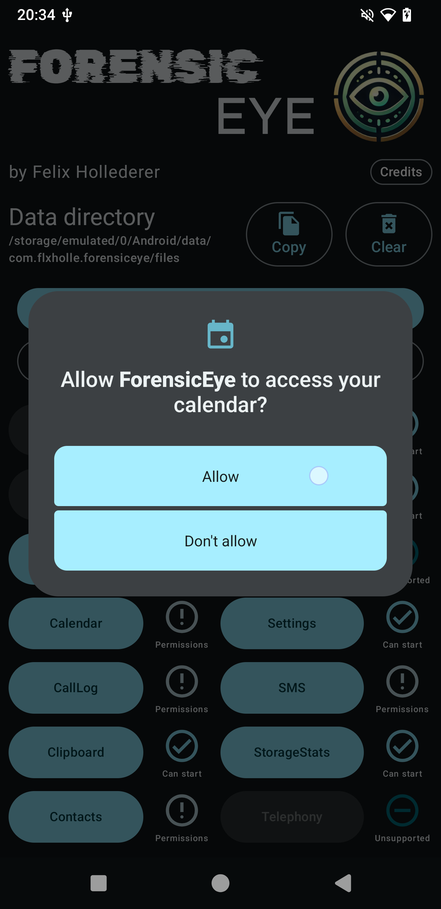
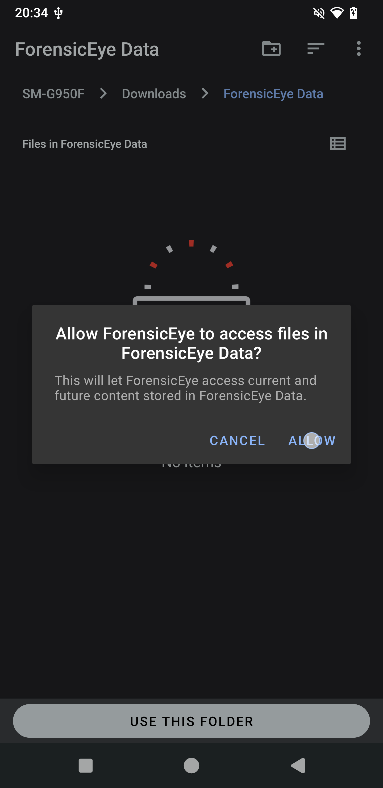

  
  <h1 align="center">ForensicEye</h1>

  

    A Modular Android App for On-Device Forensic Data Collection
  

  
Table of Contents

  <ol>
    <li>
      <a href="#about-the-project">About The Project</a>
      <ul>
        <li><a href="#features">Features</a></li>
        <li><a href="#limitations">Limitations</a></li>
        <li><a href="#built-with">Built With</a></li>
      </ul>
    </li>
    <li><a href="#usage">Usage</a></li>
    <li><a href="#roadmap">Roadmap</a></li>
    <li><a href="#contact">Contact</a></li>
    <li><a href="#acknowledgments">Acknowledgments</a></li>
    <li><a href="#license">License</a></li>
  </ol>

## About The Project

 

ForensicEye is a tool for non-root forensic data acquisition on Android devices. Unlike traditional
approaches that rely on ADB or root access, ForensicEye operates directly on the device, enabling
data extraction by non-expert users without the need for additional hardware.

### Features

- **Non-root Data Acquisition**: Retrieve data without the need for root access or ADB.
- **User-Friendly**: Designed for non-expert users to easily extract data.
- **Comprehensive Data Retrieval**: Access nearly all data available through system APIs, including:
    - Device information
    - Contacts
    - SMS
    - Calls
    - Calendars
    - Health data
  - Usage Statistics
  - Many more...
- **Modular Architecture**: Supports extensibility and maintainability.
- **Auto-Run from PC**: Ability to be launched automatically using a script for streamlined data
  collection.

### Limitations

- **Restricted Access**: Limited access to system-only APIs and third-party app data due to
  Android’s permission and sandboxing model.
- **Fragmented Environment**: Challenges posed by Android’s fragmented and evolving environment,
  including undocumented features and unstable APIs.
- **Manual Validation**: The need for manual validation due to the evolving nature of Android APIs.
- **Usage Statistics Source**: The usage statistics data source relies on GPLv3 code
  from [UsageDirect](https://codeberg.org/fynngodau/usageDirect) and is available in
  a [GPLv3 licensed branch](https://github.com/flxholle/ForensicEye/tree/usage-stats-gpl)

### Built With

* 
* 
* 

(<a href="#top">back to top</a>)

## Usage

1. Download and Install the latest APK from
   the [releases page](https://github.com/flxholle/ForensicEye/releases/latest) or use the
   `auto_run.sh` script.
2. Open the app and grant the necessary permissions, either by clicking "Grant all permissions" or
   clicking selected data source buttons with their names on it. If `Shizuku` is installed and
   running all permissions can be granted at once.
3. The icon indicator next to the data source button can have the following states:

- Unsupported: The data source is not supported on the current device or Android version.
- Permissions: The data source requires additional permissions.
- Can Start: The data source is ready to be started. To start it press the button with the data
  source name.
- Success/Failure: The data source has finished successfully or with an error.

3. Click on _Copy_ to export the data to the device's storage.
4. Access the exported data in the selected folder on your device.

### Auto-Run from PC

ForensicEye can be started automatically from a connected PC using the `auto_run.sh` script. This
script downloads and installs the APK, launches the app and runs a specific view to start data
collection. After data collection is complete the script pulls the exported data to the PC.

1. Make sure you have `adb` installed and your device connected with USB debugging enabled.
2. Download the
   `auto_run.sh` [script](https://raw.githubusercontent.com/flxholle/ForensicEye/refs/heads/main/auto_run.sh)
   and run it in a terminal.
3. The script will handle the rest. The extracted data is in a director named `ForensicEyeData` in
   the
   current working directory.

## Roadmap

- [ ] Set as default SMS or phone app to access BlockedNumbers
- [ ] Shizuku integration to access system only APIs
- [ ] Implement device owner to bypass restrictions
- [ ] Add more data sources (e.g., third-party apps) via Acessibility Services

(<a href="#top">back to top</a>)

## Contact

Felix Hollederer - [@flxholle](https://flxholle.gitlab.io/) - flxholle@posteo.com

Project
Link: https://github.com/flxholle/ForensicEye](https://github.com/flxholle/ForensicEye)

(<a href="#top">back to top</a>)

## Acknowledgments

* [Rubik Glitch Font](https://fonts.google.com/specimen/Rubik+Glitch) under the [SIL Open Font License](https://openfontlicense.org/)
* [Aldrich Font](https://fonts.google.com/specimen/Aldrich) under the [SIL Open Font License](https://openfontlicense.org/)
* [Shizuku](https://github.com/RikkaApps/Shizuku) under the [Apache License 2.0](https://github.com/RikkaApps/Shizuku/blob/master/LICENSE)
* [ACRA](https://github.com/ACRA/acra) under the [Apache License 2.0](https://github.com/ACRA/acra/blob/master/LICENSE)
* [AndroidX](https://developer.android.com/jetpack/androidx)
* [Kotlin](https://kotlinlang.org/)
* [Gradle](https://gradle.org/)

(<a href="#top">back to top</a>)

## License
Distributed under the Apache License 2.0. See `LICENSE.txt` for more information.

(<a href="#top">back to top</a>)
